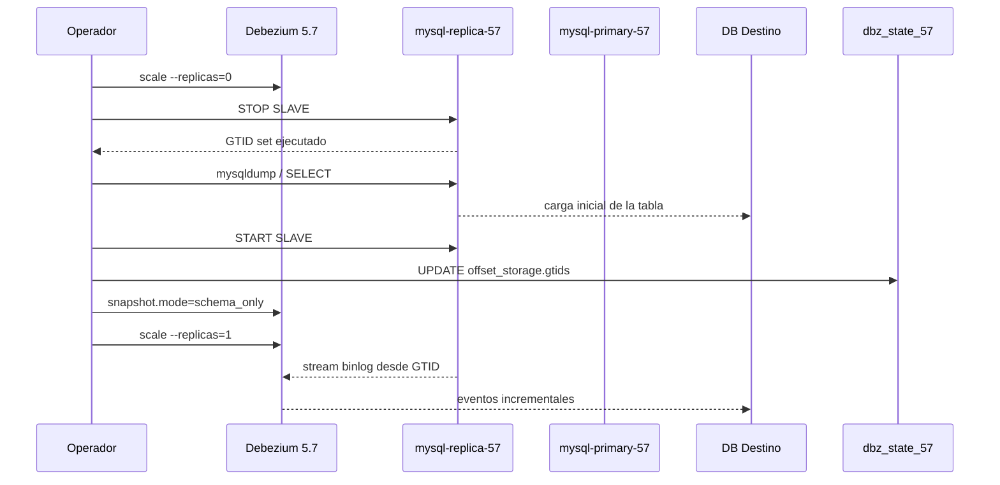
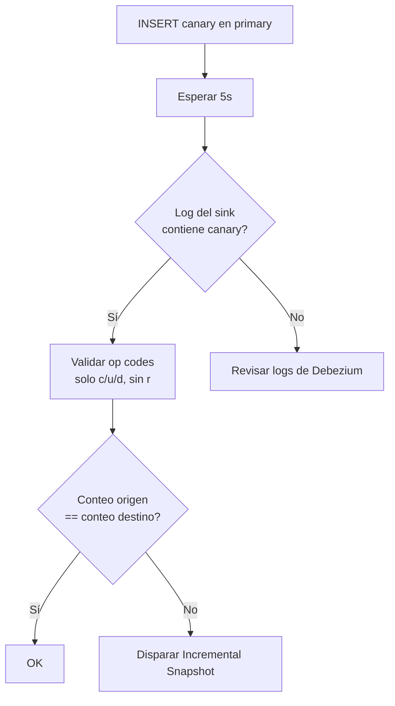
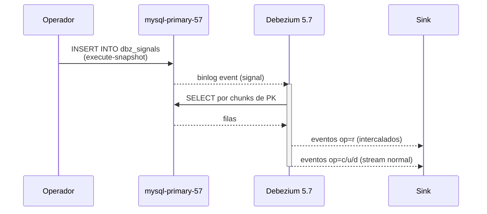

# Receta — Bootstrap inicial con ETL externa + Debezium sin gap (MySQL 5.7)

Este documento describe el procedimiento para hacer una **carga inicial** de una tabla (`inventory.customers` u otra) hacia una base de datos destino usando una ETL externa, mientras el primary sigue recibiendo escrituras, y dejar a Debezium retomando el flujo **exactamente donde la ETL paró** — sin perder eventos ni duplicarlos.

Esta variante está escrita contra el stack `mysql57` del lab (`cdc-lab`). La terminología clave en MySQL 5.7 utiliza los verbos legacy `SLAVE` (no `REPLICA`, introducido en 8.0.22+).

> El procedimiento describe pasos manuales pensados para entender el mecanismo y/o ejecutar una migración one-off. Para reconciliación recurrente se sugiere revisar la sección **Alternativa: Incremental Snapshot** al final.

---

## Modelo mental

```mermaid
flowchart LR
    Primary[(MySQL 5.7<br/>Primary)] -->|binlog<br/>replication| Replica[(MySQL 5.7<br/>Replica<br/>congelado durante ETL)]
    Replica -->|ETL extract<br/>fase one-off| Dest[(DB Destino)]
    Replica -.->|stream binlog desde<br/>GTID capturado| Dbz[Debezium Server]
    Dbz -->|eventos op=c,u,d| Sink[Sink / Kafka]
    Sink --> Dest

    style Primary fill:#444444
    style Replica fill:#004C99
    style Dbz fill:#00994D
```



> **Importante:** en este lab `withReplica`, Debezium se conecta al **replica**, no al primary. El primary no se toca en ningún momento del procedimiento; sólo recibe sus escrituras normales y propaga el binlog hacia el replica. El GTID capturado en el replica representa exactamente el mismo punto del binlog del primary (gracias a `gtid_mode=ON`), por lo que reanclar Debezium al replica equivale a reanclarlo al binlog del primary en ese punto.

La clave: capturar el **GTID set ejecutado** en `mysql-replica-57` **antes** de que la ETL empiece a leer, mientras la replicación está **pausada**. Ese GTID es el punto exacto en el binlog del primary hasta donde llegó el replica. Cualquier escritura del primary posterior a ese GTID **no** está en la ETL pero **sí** la va a emitir Debezium si se arranca desde ese GTID (que le va a llegar via replicación al replica una vez se reanude).

---

## Flujo general del procedimiento



---

## Pre-condiciones

- Lab `cdc-lab` corriendo (`make -C minikube up` y `wait-healthy`).
- `mysql-replica-57` está `Ready=1/1` con `Slave_IO_Running=Yes` y `Slave_SQL_Running=Yes`.
- Debezium del stack 57 (`debezium-server-57`) puede estar prendido o apagado al empezar — el procedimiento lo apaga al inicio para evitar carreras.
- DB destino existe y está vacía (o el operador acepta `UPSERT` por PK).
- `gtid_mode=ON` y `enforce_gtid_consistency=ON` están habilitados en el primary y el replica (sin esto, hay que sembrar `file`+`pos` en lugar de `gtids`).

---

## Variables

El operador debe ajustar los valores según el caso:

```bash
export NS=cdc-lab
export STACK=57
export REPLICA_POD=mysql-replica-${STACK}-0
export DEBEZIUM_DEPLOY=debezium-server-${STACK}
export STATE_DB=dbz_state_${STACK}
export SOURCE_DB=inventory
export SOURCE_TABLE=customers
```

---

## Paso 1 — Apagar Debezium para evitar que avance offsets durante la ETL

```bash
kubectl scale deployment/${DEBEZIUM_DEPLOY} -n ${NS} --replicas=0
kubectl wait --for=delete pod -l app=debezium-server,stack=mysql${STACK} -n ${NS} --timeout=60s
```

**Razón:** si Debezium está corriendo durante la operación, podría flushear un offset nuevo en `offset_storage` y pisar el GTID que el operador va a sembrar.

---

## Paso 2 — Pausar replicación en el replica y capturar el GTID

En MySQL 5.7 el verbo es `SLAVE` (no `REPLICA`):

```bash
# 2.1 Pausar replicación
kubectl exec -n ${NS} ${REPLICA_POD} -- \
  mysql -uroot -proot -e "STOP SLAVE;"

# 2.2 Capturar el GTID set ejecutado (el punto exacto del binlog del primary
#     hasta donde aplicó este replica). Se guarda en una variable y/o archivo.
ETL_GTID_SET=$(kubectl exec -n ${NS} ${REPLICA_POD} -- \
  mysql -uroot -proot -N -B -e "SELECT @@global.gtid_executed;")
echo "$ETL_GTID_SET" | tee /tmp/etl-snapshot-gtid.txt
# Ejemplo de output:
#   d1743efb-4fb3-11f1-b913-d6910689b128:1-2394,dfbdba16-4fb3-11f1-bbb9-06bc30b893d4:1-5

# 2.3 Captura también el binlog file+pos (defensa en profundidad / útil para diagnóstico)
kubectl exec -n ${NS} ${REPLICA_POD} -- \
  mysql -uroot -proot -e "SHOW SLAVE STATUS\G" \
  | grep -E "(Relay_Master_Log_File|Exec_Master_Log_Pos|Executed_Gtid_Set)" \
  | tee -a /tmp/etl-snapshot-gtid.txt
```

> El terminador `\G` solo es interpretado por el CLI `mysql`. Desde un cliente gráfico (DataGrip, DBeaver) hay que reemplazarlo por `;` y usar la vista "Transpose" para ver el resultado en formato vertical.

**Validación:** `/tmp/etl-snapshot-gtid.txt` debe tener una línea con el GTID set. Es crítico — sin este número no hay manera de re-anclar Debezium.

---

## Paso 3 — Ejecutar la ETL contra el replica congelado

Mientras `STOP SLAVE` está vigente, el replica es una snapshot estática consistente. La tabla se puede leer como el operador prefiera:

### Opción A — `mysqldump`

```bash
kubectl exec -n ${NS} ${REPLICA_POD} -- \
  mysqldump -uroot -proot --no-tablespaces --single-transaction \
  ${SOURCE_DB} ${SOURCE_TABLE} \
  > /tmp/etl-${SOURCE_TABLE}.sql
```

### Opción B — `SELECT ... INTO OUTFILE` o cliente externo

```bash
# Port-forward al replica si la ETL externa lo necesita:
kubectl port-forward -n ${NS} svc/mysql-replica-${STACK} 3309:3306 &

# La herramienta de ETL preferida (DBeaver export, custom script, etc.)
# se conecta a localhost:3309 user=root pass=root y vuelca la tabla al destino.
```

**Importante:** no se debe hacer `START SLAVE` aún. La replicación debe permanecer pausada hasta que la ETL termine de leer.

---

## Paso 4 — Cargar al destino

La carga al destino se realiza como el operador prefiera: `mysql < /tmp/etl-customers.sql`, `pandas → INSERT`, Kafka Connect JDBC sink, Spark, etc.

Consideraciones para el resto del procedimiento:

- Mantener la **PK exacta** del origen (`id` para `customers`).
- Si se hacen transformaciones, garantizar que sean idempotentes cuando se vuelvan a aplicar — porque cuando Debezium reemita eventos, el sink va a hacer `UPSERT` por PK y debe converger al mismo estado.

---

## Paso 5 — Reanudar replicación

```bash
kubectl exec -n ${NS} ${REPLICA_POD} -- \
  mysql -uroot -proot -e "START SLAVE;"

# Verificar que se está poniendo al día:
kubectl exec -n ${NS} ${REPLICA_POD} -- \
  mysql -uroot -proot -e "SHOW SLAVE STATUS\G" \
  | grep -E "(Slave_IO_Running|Slave_SQL_Running|Seconds_Behind_Master)"
# Ambos *_Running deben ser Yes; Seconds_Behind_Master debe bajar a 0 en pocos segundos.
```

Desde este momento el replica vuelve a recibir eventos del primary; el GTID en `/tmp/etl-snapshot-gtid.txt` ya no se mueve (es el momento del freeze; está congelado en disco como referencia).

---

## Paso 6 — Obtener una fila de offset con el shape correcto

El `offset_val` que espera `debezium-storage-jdbc` es un JSON con estructura específica que depende de la versión de Debezium y del prefijo del topic. **No** se debe escribir a mano — el operador lo bootstrapea desde Debezium mismo.

Si **ya** hay una fila en `dbz_state_57.offset_storage` (porque Debezium corrió antes):

```bash
ROOT=$(kubectl get secret -n ${NS} debezium-state-credentials -o jsonpath='{.data.root-password}' | base64 -d)
kubectl exec -n ${NS} deploy/mysql-debezium-state -- \
  mysql -uroot -p"$ROOT" -N -B -e \
  "SELECT id, offset_key, offset_val FROM ${STATE_DB}.offset_storage LIMIT 1;" \
  | tee /tmp/offset-template.tsv
```

Si **no** existe fila (cold start), el operador arranca Debezium una vez por unos 30 segundos con `snapshot.mode=initial` solo para que genere la fila. Luego lo apaga y continúa.

---

## Paso 7 — Modificar el offset para que apunte al GTID capturado

El campo `offset_val` es un JSON. Tiene un subcampo `gtids` (la cadena GTID set) y opcionalmente `file`+`pos`. Se reemplaza **solo** el `gtids` con el valor de `/tmp/etl-snapshot-gtid.txt`.

```mermaid
flowchart TD
    A[offset_val actual<br/>gtids=&quot;valor_antiguo&quot;] --> B{JSON_SET}
    C[/tmp/etl-snapshot-gtid.txt<br/>NEW_GTID] --> B
    B --> D[offset_val nuevo<br/>gtids=&quot;NEW_GTID&quot;]
    D --> E[(offset_storage<br/>actualizada)]
```

```bash
# Inspeccionar el JSON actual para ver el shape:
kubectl exec -n ${NS} deploy/mysql-debezium-state -- \
  mysql -uroot -p"$ROOT" -N -B -e \
  "SELECT offset_val FROM ${STATE_DB}.offset_storage LIMIT 1;"
# Ejemplo de salida (formateado):
# {
#   "transaction_id": null,
#   "ts_sec":         1747000000,
#   "file":           "mysql-bin.000003",
#   "pos":            1234567,
#   "gtids":          "<gtid_antiguo>",
#   "row":            0,
#   "server_id":      1,
#   "event":          2
# }

# Reescribir el offset_val con el nuevo gtids.
# La forma más segura: usar JSON_SET para no romper el JSON.
NEW_GTID=$(cat /tmp/etl-snapshot-gtid.txt | head -1)

kubectl exec -n ${NS} deploy/mysql-debezium-state -- \
  mysql -uroot -p"$ROOT" -e "
    USE ${STATE_DB};
    UPDATE offset_storage
       SET offset_val      = JSON_SET(offset_val, '\$.gtids', '${NEW_GTID}'),
           record_insert_ts = CURRENT_TIMESTAMP,
           record_insert_seq = record_insert_seq + 1
     WHERE id = (SELECT id FROM (SELECT id FROM offset_storage LIMIT 1) AS x);
    SELECT id, offset_val FROM offset_storage;
  "
```

**Validación:** la fila resultante debe tener `\"gtids\":\"<el GTID nuevo>\"` en el JSON.

> **Nota sobre `file`/`pos`:** si Debezium usa GTID, `gtids` es la fuente de verdad y `file`/`pos` se reescriben automáticamente al primer evento. Si MySQL está **sin GTID** (`gtid_mode=OFF`), hay que sembrar `file` y `pos` también — pero el lab usa `gtid_mode=ON`, así que GTID basta.

---

## Paso 8 — Configurar Debezium en modo `schema_only`

Sin esto, al arrancar Debezium podría intentar hacer su propio snapshot y reemitir todas las filas que la ETL ya cargó.

```bash
# Patch del ConfigMap debezium-config-57
kubectl get configmap debezium-config-${STACK} -n ${NS} -o yaml \
  | sed 's/debezium.source.snapshot.mode=initial/debezium.source.snapshot.mode=schema_only/' \
  | kubectl apply -f -

# Verificar:
kubectl get configmap debezium-config-${STACK} -n ${NS} -o jsonpath='{.data.application\.properties}' \
  | grep snapshot.mode
# Esperado: debezium.source.snapshot.mode=schema_only
```

> **Nota sobre versiones:** en Debezium 2.5+ el nombre es `no_data` (alias). Si `schema_only` falla en logs con "Unknown snapshot mode", el operador debe usar `no_data`.

---

## Paso 9 — Encender Debezium y verificar que arranca desde el GTID sembrado

```bash
kubectl scale deployment/${DEBEZIUM_DEPLOY} -n ${NS} --replicas=1
kubectl rollout status deployment/${DEBEZIUM_DEPLOY} -n ${NS} --timeout=120s
```

El operador revisa los logs y busca el offset desde el que arranca:

```bash
kubectl logs -n ${NS} deploy/${DEBEZIUM_DEPLOY} \
  | grep -E "(Connected to binlog|Final merged GTID set|starting at|GTID set to use)" \
  | tail -10
```

Debería aparecer una línea tipo:

```
Connected to mysql-replica-57:3306 at d1743efb-4fb3-...:1-2394,dfbdba16-...:1-5 (sid:43, cid:NNNN)
```

Se confirma que el GTID set ahí coincide con `/tmp/etl-snapshot-gtid.txt`.

---

## Paso 10 — Validar end-to-end



### 10.1 — Validar que no haya gap

Generar un evento **nuevo** en el primary y confirmar que llega al sink:

```bash
kubectl exec -n ${NS} mysql-primary-${STACK}-0 -- \
  mysql -uroot -proot -e \
  "INSERT INTO inventory.customers (first_name, last_name, email)
   VALUES ('CanaryFirst', 'CanaryLast', 'canary-$(date +%s)@etl.test');"

sleep 5
kubectl logs -n ${NS} deploy/cdc-sink-${STACK} --tail=20 \
  | grep -i CanaryFirst
# Esperado: aparece el evento JSON con first_name="CanaryFirst"
```

### 10.2 — Validar que no haya reproceso del rango cubierto por la ETL

El operador inspecciona los logs del sink **desde el arranque** de Debezium y busca eventos `op=r` (read del snapshot). En `snapshot.mode=schema_only` no debería haber ningún `op=r`:

```bash
kubectl logs -n ${NS} deploy/cdc-sink-${STACK} --since=5m \
  | grep -oE '"op":"[a-z]"' | sort | uniq -c
# Esperado: solo "op":"c" / "op":"u" / "op":"d", NUNCA "op":"r"
```

### 10.3 — Conteo total en destino vs origen

```bash
# En el primary
kubectl exec -n ${NS} mysql-primary-${STACK}-0 -- \
  mysql -uroot -proot -N -B -e "SELECT COUNT(*) FROM inventory.customers;"

# En la DB destino (depende del setup; ejemplo si es otra MySQL):
# SELECT COUNT(*) FROM mi_destino.customers;
```

Los conteos deben coincidir. Si no, hay drift y se necesita un **Incremental Snapshot** para reconciliar (siguiente sección).

---

## Alternativa más robusta: Incremental Snapshot

Si los pasos 6–8 resultan incómodos (manipular el offset a mano es frágil), Debezium 2.x+ ofrece un mecanismo de re-snapshot **on-demand** que se dispara via una "signal table" en el origen, sin tocar el offset.



### Setup una sola vez

```sql
-- En el primary:
USE inventory;
CREATE TABLE dbz_signals (
  id   VARCHAR(42)  PRIMARY KEY,
  type VARCHAR(32)  NOT NULL,
  data VARCHAR(2048)
);
```

En `debezium-config-${STACK}`, agregar:

```properties
debezium.source.signal.data.collection=inventory.dbz_signals
```

Reapply el ConfigMap y reiniciar el Pod.

### Disparar un re-snapshot incremental

```sql
-- En el primary:
INSERT INTO inventory.dbz_signals (id, type, data) VALUES (
  UUID(),
  'execute-snapshot',
  '{"data-collections":["inventory.customers"],"type":"INCREMENTAL"}'
);
```

Debezium ve esa fila (porque está en el binlog), arranca a re-snapshotear `inventory.customers` por chunks de PK, intercalando eventos `op=r` con el stream normal. El sink hace `UPSERT` y queda reconciliado, sin parar Debezium ni perder el flujo continuo.

**Ventajas vs el approach manual:**

| Aspecto | Manual (Pasos 1–10) | Incremental Snapshot |
|---|---|---|
| Coordinación con ETL | Sí (pausar replica, capturar GTID) | No |
| Ventana de "freeze" | Sí, durante la ETL | Cero |
| Manipula offset a mano | Sí | No |
| Útil para bootstrap inicial cuando la ETL la hace otro equipo | ✅ | Más limitado |
| Útil para reconciliación recurrente | ❌ (es one-off) | ✅ |
| Funciona con Debezium 1.x | ✅ | ❌ (requiere 2.0+) |

**Patrón recomendado en producción:** usar los Pasos 1–10 para el **bootstrap inicial** (cuando se establece el pipeline por primera vez) y dejar un **Incremental Snapshot programado** (mensual o trimestral) para detectar y corregir drift por cualquier causa.

---

## Rollback

Si algo sale mal entre el Paso 6 y el Paso 9, el operador puede volver al estado anterior:

```bash
# Si tenía el offset_val anterior guardado (Paso 6) en /tmp/offset-template.tsv:
OLD_VAL=$(cut -f3 /tmp/offset-template.tsv | head -1)
kubectl exec -n ${NS} deploy/mysql-debezium-state -- \
  mysql -uroot -p"$ROOT" -e \
  "UPDATE ${STATE_DB}.offset_storage SET offset_val='${OLD_VAL}' LIMIT 1;"

# Volver snapshot.mode a su valor previo (initial por default):
kubectl get configmap debezium-config-${STACK} -n ${NS} -o yaml \
  | sed 's/debezium.source.snapshot.mode=schema_only/debezium.source.snapshot.mode=initial/' \
  | kubectl apply -f -

# Reiniciar Debezium:
kubectl rollout restart deployment/${DEBEZIUM_DEPLOY} -n ${NS}
```

Si se quiere **borrar el offset y dejar a Debezium hacer un snapshot completo de cero** (rollback nuclear, se pierde la migración y se arranca de nuevo):

```bash
kubectl exec -n ${NS} deploy/mysql-debezium-state -- \
  mysql -uroot -p"$ROOT" -e \
  "TRUNCATE TABLE ${STATE_DB}.offset_storage; TRUNCATE TABLE ${STATE_DB}.schema_history;"
# Ahora reiniciar Debezium con snapshot.mode=initial; va a re-snapshot todo.
```

---

## Troubleshooting

| Síntoma | Causa probable | Cómo arreglar |
|---|---|---|
| Debezium arranca y reemite todas las filas como `op=r` | `snapshot.mode` quedó en `initial` | Volver al Paso 8: cambiar a `schema_only` o `no_data` |
| Debezium arranca y reemite eventos viejos antes del GTID sembrado | El `offset_val.gtids` no se aplicó correctamente | Inspeccionar la fila con `SELECT offset_val FROM offset_storage`; confirmar que el `gtids` es el correcto |
| Debezium reemite eventos **después** del GTID sembrado pero antes de los recientes | El GTID capturado en Paso 2 fue de un punto demasiado atrás | Volver a hacer la ETL con un snapshot más reciente; se pierde la primera corrida |
| `SHOW SLAVE STATUS` muestra `Seconds_Behind_Master` creciendo después de `START SLAVE` | La ETL tomó mucho tiempo, el replica está al día tras alcanzar al primary | Esperar; debería estabilizar en 0 |
| Conteos no coinciden entre origen y destino al final del Paso 10.3 | Drift por causas distintas al bootstrap (bug del sink, conexión caída, etc.) | Disparar un Incremental Snapshot (sección "Alternativa") para reconciliar |
| Logs de Debezium: `Unknown snapshot mode 'schema_only'` | Versión que solo acepta `no_data` (nombre nuevo) | Cambiar `schema_only` por `no_data` en el ConfigMap |
| Logs de Debezium: `Cannot find binlog file mysql-bin.NNNNN` | El binlog se purgó (excede `expire_logs_days` / `binlog_expire_logs_seconds`) antes de que Debezium lo leyera | El GTID capturado quedó fuera de retención. Hay que rehacer la ETL desde cero. Considerar aumentar `expire_logs_days` durante la migración. |
| `SQL Error [1064] near '\G'` desde DataGrip/DBeaver | El terminador `\G` es del CLI `mysql`, no del protocolo | Reemplazar `\G` por `;` y usar vista "Transpose" en la GUI |

---

## Apéndice — Por qué `STOP SLAVE` en lugar de `FLUSH TABLES WITH READ LOCK`

Ambos dan una "vista congelada" para hacer la ETL, pero con costos distintos:

| Mecanismo | Bloquea escrituras en primary | Bloquea lecturas en primary | Aísla replica |
|---|---|---|---|
| `FLUSH TABLES WITH READ LOCK` en **primary** | ✅ (downtime de escrituras) | ❌ | ❌ |
| `START TRANSACTION WITH CONSISTENT SNAPSHOT` en **primary** | ❌ | ❌ | ❌ |
| `STOP SLAVE` en **replica** (este procedimiento) | ❌ | ❌ | ✅ |

`STOP SLAVE` es la mejor opción cuando:

- Hay un replica disponible (cierto en el lab y en producción típica).
- No se quiere añadir carga de SELECT pesados al primary.
- Se requiere una ventana de tiempo larga para la ETL sin presión sobre el primary.

La única "desventaja" es que el replica se queda atrás durante la ETL, pero eso es transparente para los consumidores (no hay nada apuntando al replica salvo Debezium, y este está apagado). Cuando se ejecuta `START SLAVE` se pone al día en segundos para una tabla típica.

---

## Apéndice — Diferencias clave de MySQL 5.7 vs MySQL 8

| Concepto | MySQL 5.7 (este doc) | MySQL 8 |
|---|---|---|
| Pausar replicación | `STOP SLAVE` | `STOP REPLICA` |
| Reanudar replicación | `START SLAVE` | `START REPLICA` |
| Ver estado | `SHOW SLAVE STATUS\G` | `SHOW REPLICA STATUS\G` |
| Hilo I/O | `Slave_IO_Running` | `Replica_IO_Running` |
| Hilo SQL | `Slave_SQL_Running` | `Replica_SQL_Running` |
| Lag | `Seconds_Behind_Master` | `Seconds_Behind_Source` |

> Los verbos `SLAVE` siguen funcionando en MySQL 8 como alias deprecados, pero los nuevos `REPLICA` son los preferidos. En sentido contrario, los verbos `REPLICA` **no** existen en MySQL 5.7 y devuelven error de sintaxis.
